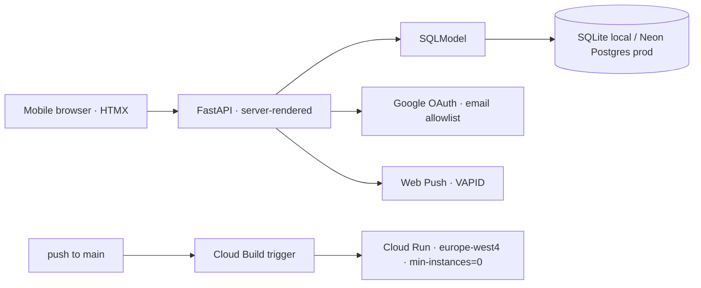

# family_tasks

A mobile-first shared to-do app — server-rendered FastAPI + HTMX, deployed on Cloud Run, with Web Push notifications.


## Why

A dead-simple, phone-first shared task list with reliable reminders without the overhead of a single-page app or the cost of a paid push service. family-tasks is that app, engineered to run seamlessly and notify users.

## What it does

- Server-rendered task management (create/assign/complete), optimized for mobile.
- Google OAuth login restricted to an email allowlist.
- Web Push notifications via VAPID; no Firebase/FCM.
- Database-agnostic: SQLModel over `DATABASE_URL` (SQLite locally, Neon Postgres in production).
- Auto-deploys on push to `main` via a Cloud Build trigger; secrets in GCP Secret Manager.

## Architecture



## Stack

- **FastAPI + HTMX** — server-rendered, no SPA build step or client-state overhead.
- **SQLModel** — a single model layer that swaps databases via one env var.
- **Google Cloud Run** (europe-west4) — scale-to-zero.
- **Web Push / VAPID** — push notifications.
- **Google OAuth** — auth gated to an email allowlist (`auth.py:auth_callback`).
- **GCP Secret Manager + Cloud Build** — secret storage and push-to-deploy CI/CD.

## Run it

```bash
cp .env.example .env   # DATABASE_URL, Google OAuth creds, VAPID keys
# _verify exact entrypoint against the repo_
uvicorn app.main:app --reload
```

## Results / demo

<!-- > **Note:** the live app is OAuth-gated to allowed emails, so a recruiter **cannot log in**. Don't link a bare login page as the "demo." Instead show the flow with a GIF/screenshots and describe the architecture. -->

<!-- TODO: add screenshots or a GIF of the task flow -->

## What I learned

- **Web Push** — implementing VAPID directly instead of reaching for Firebase/FCM dependency.
- **DB-agnostic from day one** — putting SQLModel behind `DATABASE_URL` meant SQLite locally and Postgres in prod with zero code change.
- **Scale-to-zero economics** — `min-instances=0` + Cloud Build trigger gives push-to-deploy.